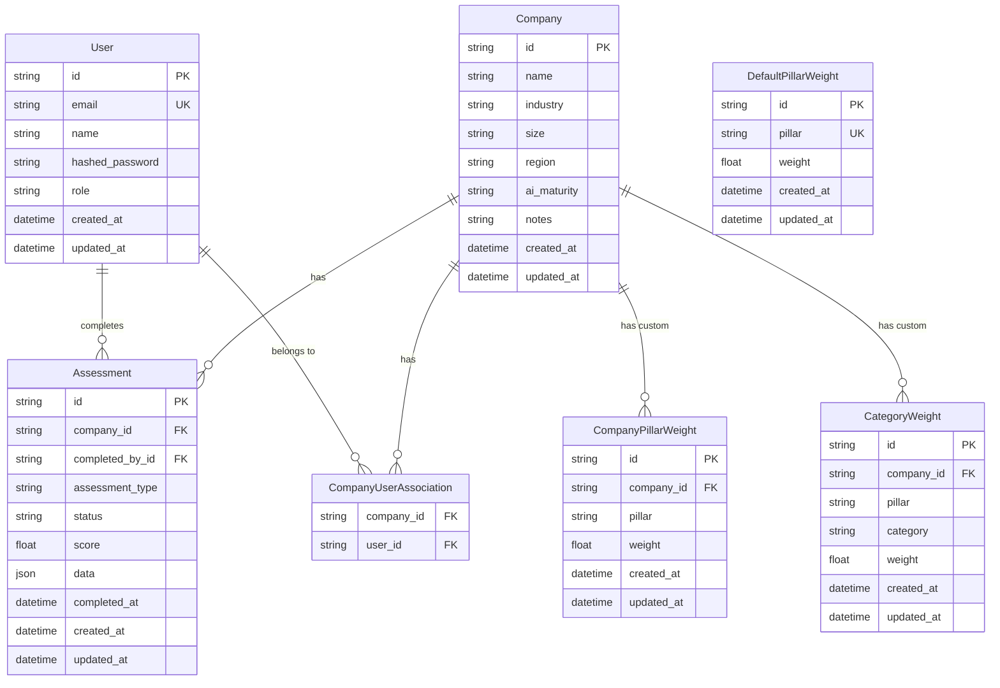
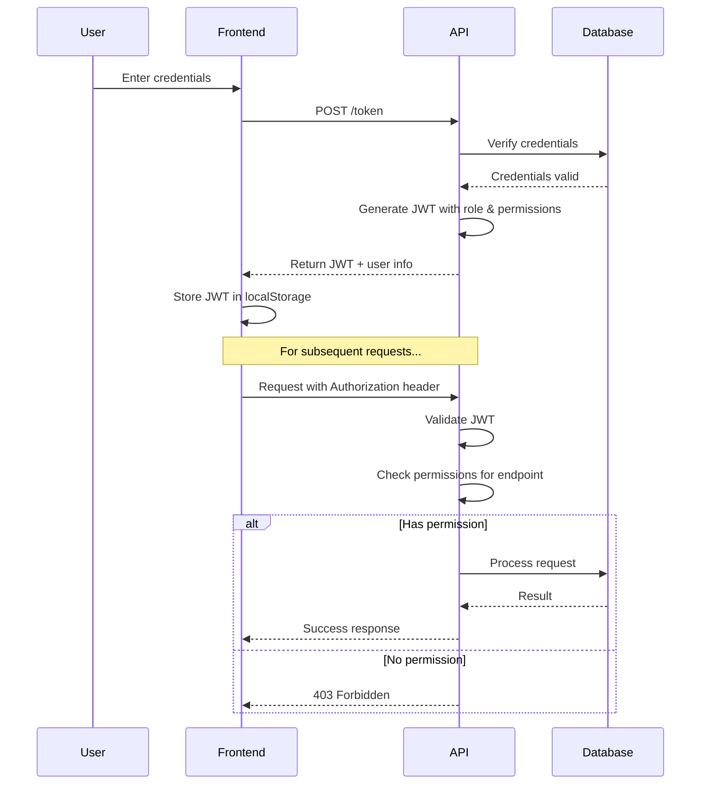
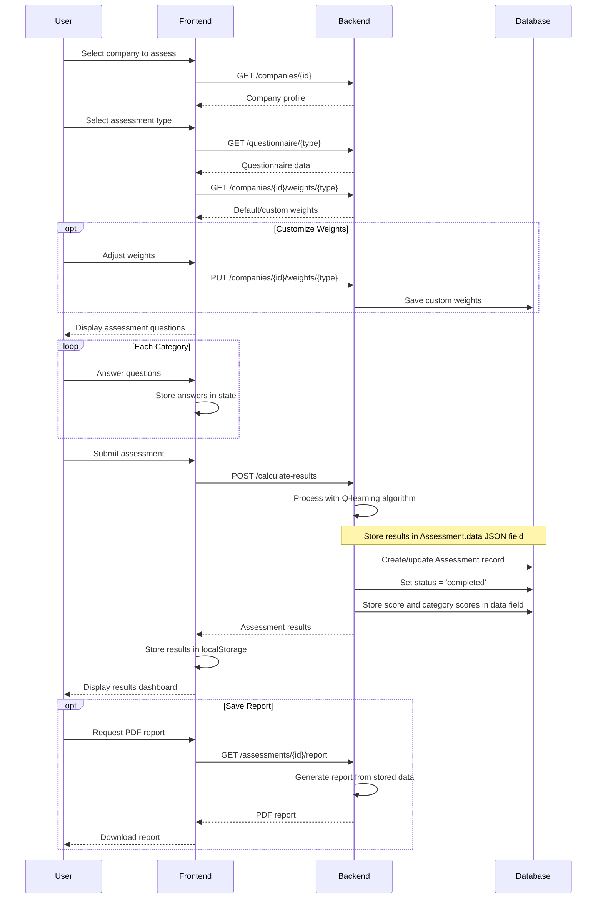
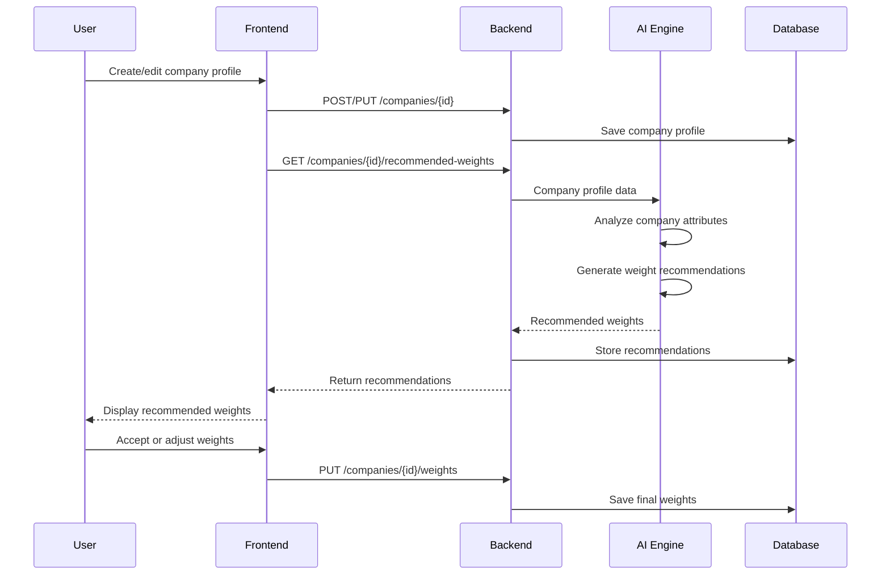

# AI Readiness Assessment Platform - Comprehensive Architecture

This document provides a detailed overview of the architecture, data flow, and component interactions for the AI Readiness Assessment platform.

## 1. System Architecture Overview


## 2. Core Business Flow

The AI Readiness Assessment Platform follows this business flow:

1. **Admin User Management**
   - Admins create and manage user accounts with different roles (admin, evaluator, user)
   - Each user has specific permissions within the system

2. **Company Onboarding**
   - Admin adds companies requiring AI readiness assessment
   - Company profiles are created with industry, size, and other relevant information

3. **User-Company Assignment**
   - Admin assigns specific users to companies based on roles
   - Role-based access controls what users can see and do with each company

4. **Assessment Configuration**
   - System provides AI-recommended weights for different assessment pillars based on company profile
   - Admin or authorized users can adjust these weights if needed

5. **Assessment Execution**
   - Assigned users conduct assessments for their companies
   - Assessment spans multiple pillars (Governance, Culture, Infrastructure, Strategy, Data, Talent)
   - Responses are collected for each category within pillars

6. **Result Processing**
   - Backend uses Q-learning algorithm to process responses
   - Weighted scores are calculated for each category and pillar
   - Overall AI readiness score is determined

7. **Reporting and Analysis**
   - Detailed reports show strengths and weaknesses across pillars
   - Recommendations are provided for improvement areas
   - Historical assessment data allows tracking progress over time

## 3. Database Schema

### 3.1 Core Entities



### 3.2 Key Relationships

- **User-Company**: Many-to-many relationship through `company_user_association` table
- **Assessment**: Linked to both Company (owner) and User (completed_by)
- **Weights**: Two types of company-specific weights:
  - `CompanyPillarWeight`: Weights for each pillar (AI Governance, AI Culture, etc.)
  - `CategoryWeight`: Weights for specific categories within each pillar
- **DefaultPillarWeight**: Global default weights used when company-specific weights aren't defined

### 3.3 Data Storage Implementation

The backend uses SQLAlchemy ORM with the following implementation details:

1. **SQLite Database**: `app.db` file stores all application data (for production, PostgreSQL is recommended)
2. **Association Tables**: Many-to-many relationships implemented via association tables
3. **JSON Storage**: Complex nested data (like assessment results) stored as JSON in the `data` field
4. **Timestamps**: All entities include created_at/updated_at fields for audit purposes
5. **Cascading Deletes**: Parent-child relationships configured with cascade delete options where appropriate

## 4. Backend Architecture (FastAPI)

### 4.1 Component Structure

- **FastAPI Application (`main.py`)**: Core API server with endpoint definitions
- **Data Models (`models.py`)**: SQLAlchemy models and Pydantic schemas
- **Database Layer**: SQLite in development, PostgreSQL recommended for production
- **Authentication**: JWT-based authentication with role validation
- **Assessment Engine**: Q-learning algorithm implementation for assessment processing

### 4.2 API Endpoints

| Category | Endpoint | Method | Description | Authentication |
|----------|----------|--------|-------------|----------------|
| **Authentication** | `/token` | POST | Login with username/password, returns JWT | None |
| **Users** | `/users/me` | GET | Get current user profile | JWT |
| | `/users` | GET | List all users (with pagination) | Admin JWT |
| | `/users` | POST | Create new user | Admin JWT |
| | `/users/{user_id}` | GET | Get specific user by ID | Admin/Self JWT |
| **Companies** | `/companies` | GET | List accessible companies | JWT |
| | `/companies` | POST | Create new company | Admin JWT |
| | `/companies/{company_id}` | GET | Get company details | JWT + Access |
| | `/companies/{company_id}` | PUT | Update company | Admin JWT |
| | `/companies/{company_id}` | DELETE | Delete company | Admin JWT |
| | `/companies/{company_id}/assign-users` | POST | Assign users to company | Admin JWT |
| | `/companies/{company_id}/users` | GET | List users assigned to company | JWT + Access |
| **Assessments** | `/assessments` | POST | Create assessment | JWT + Access |
| | `/assessments/{id}` | GET | Get assessment | JWT + Access |
| | `/assessments/{id}` | PUT | Update assessment | JWT + Access |
| | `/companies/{company_id}/assessments` | GET | List company assessments | JWT + Access |
| | `/calculate-results` | POST | Process assessment results | JWT |
| **Questionnaires** | `/questionnaires` | GET | Get all questionnaire templates | Any |
| | `/questionnaire/{type}` | GET | Get specific questionnaire type | Any |
| **Weights** | `/weights/defaults` | GET | Get default weights | JWT |
| | `/weights/defaults` | PUT | Update default weights | Admin JWT |
| | `/companies/{company_id}/weights` | GET | Get company pillar weights | JWT + Access |
| | `/companies/{company_id}/weights` | PUT | Update company pillar weights | JWT + Access |
| | `/companies/{company_id}/weights/{pillar}` | GET | Get category weights for pillar | JWT + Access |
| | `/companies/{company_id}/weights/{pillar}` | PUT | Update category weights for pillar | JWT + Access |
| **Recommendations** | `/recommendations/{assessment_type}/{category}` | GET | Get recommendations based on score | JWT |

### 4.3 Authentication & Authorization Flow



## 5. Frontend Architecture (Next.js)

### 5.1 Component Structure

- **Pages**: Organized by route (`/companies`, `/assessments`, etc.)
- **Components**: Reusable UI elements (forms, cards, tables, etc.)
- **Layouts**: Page templates (admin layout, assessment layout, etc.)
- **API Clients**: Services for backend communication
- **Stores**: State management for application data
- **Hooks**: Custom React hooks for shared functionality

### 5.2 State Management

- **Local Storage**: Caching assessment data and user preferences
- **API Client State**: Managing API request state and responses
- **Context Providers**: Global state management

### 5.3 Key Pages and Access Control

| Page | Route | Access Level | Description |
|------|-------|--------------|-------------|
| Home | `/` | Public | Landing page with login |
| Login | `/login` | Public | Authentication page |
| Dashboard | `/dashboard` | All logged in | Overview based on role |
| User Management | `/admin/users` | Admin | Manage user accounts |
| Companies | `/admin/companies` | Admin | Manage companies |
| Company Profile | `/companies/{id}` | Assigned Users | View company details |
| Assessment Selection | `/assessment` | Assigned Users | Choose assessment type |
| Assessment | `/assessment/{type}` | Assigned Users | Complete assessment |
| Results | `/results/{id}` | Assigned Users | View assessment results |
| Reports | `/reports` | Admin/Assigned | Comparative reporting |

## 6. Assessment Process Flow

### 6.1 Complete Assessment Workflow



### 6.2 Data Structure for Assessment Results

The backend stores assessment responses and results in a structured JSON format within the `Assessment.data` field:

```json
{
  "assessmentType": "AI Governance",
  "categoryResponses": [
    {
      "category": "AI Ethics and Responsible AI",
      "weight": 25.0,
      "responses": [
        { "question": "Does your organization have an AI ethics policy?", "answer": 3 },
        { "question": "How regularly are AI systems audited for bias?", "answer": 2 }
      ]
    },
    {
      "category": "AI Risk Management",
      "weight": 25.0,
      "responses": [
        { "question": "Do you have AI risk assessment processes?", "answer": 4 },
        { "question": "Is there a response plan for AI incidents?", "answer": 3 }
      ]
    }
  ],
  "categoryScores": {
    "AI Ethics and Responsible AI": 2.5,
    "AI Risk Management": 3.5
  },
  "userWeights": {
    "AI Ethics and Responsible AI": 25.0,
    "AI Risk Management": 25.0
  },
  "adjustedWeights": {
    "AI Ethics and Responsible AI": 23.5,
    "AI Risk Management": 26.5
  },
  "overallScore": 3.01,
  "completedAt": "2023-07-14T15:30:00Z"
}
```

### 6.3 AI-Powered Weight Recommendation



## 7. Data Synchronization Strategy

### 7.1 Backend-Database Synchronization

- **ORM Layer**: SQLAlchemy manages database interactions
- **Transactions**: ACID compliance for data integrity
- **Migrations**: Alembic for schema evolution

### 7.2 Frontend-Backend Synchronization

- **API Client**: Centralized API access through client libraries
- **Caching Strategy**: LocalStorage with TTL for frequently accessed data
- **Offline Support**: Assessment data cached for offline completion
- **Sync Mechanism**: Background synchronization when connection restored

### 7.3 Error Handling

- **Backend Validation**: Input validation at API boundaries
- **Frontend Validation**: Form validation before submission
- **Error Reporting**: Structured error responses with codes
- **Retry Logic**: Automatic retry for intermittent failures

## 8. Reporting and Analytics

### 8.1 Assessment Reports

- Individual assessment results with scores per pillar and category
- Comparative analysis against industry benchmarks
- Recommendations based on scores and company profile
- Historical trend analysis for repeat assessments

### 8.2 Admin Analytics

- Aggregated metrics across companies and assessments
- Industry-specific insights and trends
- User activity and engagement metrics
- System usage and performance analytics

## 9. Security Considerations

- **Authentication**: JWT with proper expiration and refresh mechanism
- **Authorization**: Role-based access control at API and UI levels
- **Data Protection**: Encryption for sensitive data
- **API Security**: Rate limiting, CORS configuration
- **Input Validation**: Thorough validation at all input points

## 10. Deployment Architecture

### 10.1 Development Environment

- **Frontend**: Next.js development server (`localhost:3000`)
- **Backend**: Uvicorn dev server (`103.18.20.205:8090`)
- **Database**: SQLite file (`app.db`)

### 10.2 Production Environment

- **Frontend**: Containerized Next.js with Nginx
- **Backend**: Containerized FastAPI with Gunicorn
- **Database**: PostgreSQL with proper backup strategy
- **Caching**: Redis for performance optimization
- **Load Balancing**: For horizontal scaling
- **Monitoring**: Prometheus and Grafana for metrics

## 11. Improvement Recommendations

1. **Enhanced Role-Based Access**: Implement more granular permissions beyond basic roles
2. **AI Recommendation Engine**: Strengthen the AI engine for more accurate weight recommendations
3. **Offline Mode**: Improve offline capabilities for field assessments
4. **Reporting Engine**: Enhance report generation with more visualization options
5. **Integration Capabilities**: Add API endpoints for third-party integration
6. **Multi-tenancy**: Isolation between different client organizations
7. **Notification System**: Email/in-app notifications for assessment status changes
8. **Benchmarking**: Enhanced industry benchmark comparisons
9. **Audit Trail**: Comprehensive logging of all system activities
10. **Performance Optimization**: Query optimization and caching strategies 